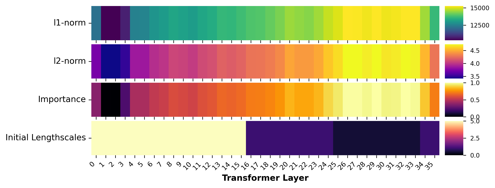
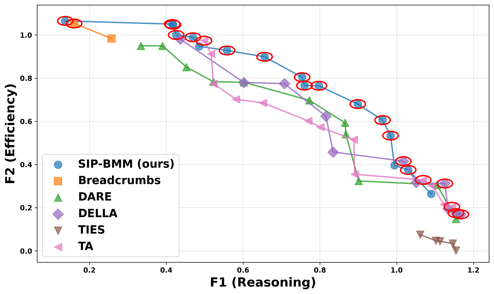

# SIP-BMM: Constructing the Capability–Efficiency Pareto Set for LLMs via Structural Importance Prior Bayesian Model Merging

<div align="center">

[-b31b1b.svg)](https://arxiv.org/)
[](https://opensource.org/licenses/MIT)
[](https://www.python.org/downloads/release/python-390/)

📌 **Repo**: [https://github.com/MiLab-HITSZ/2026-SIPBMM](https://github.com/MiLab-HITSZ/2026-SIPBMM) 

</div>

---

## Abstract

Constructing a Pareto set is pivotal for navigating the capability–efficiency trade-offs in Large Language Models (LLMs). However, existing merging techniques remain inadequate: coarse-grained **model-level** methods yield sparse suboptimal solutions, while fine-grained **layer-wise** approaches suffer from the curse of dimensionality, making the search space computationally intractable.

We propose **SIP-BMM** (**S**tructural **I**mportance **P**rior **B**ayesian **M**odel **M**erging), an evolutionary multi-objective optimization framework for automatically constructing the LLM Pareto set. SIP-BMM introduces a **Structural Importance Prior (SIP)** derived from task-vector differences to quantify layer sensitivity, and uses it to warm-start **importance-aware SAASBO** (Sparse Axis-Aligned Subspace Bayesian Optimization). This makes high-dimensional layer-wise optimization feasible under strict evaluation budgets. The overall process is driven by **Log-Noisy Expected Hypervolume Improvement ($q$NEHVI)** to efficiently explore the capability–efficiency frontier.

<div align="center">
  
  <br>
  <em>SIP-BMM.</em>
</div>

---

## Key Features

- **Structural Importance Prior (SIP)**: estimates per-layer sensitivity from task-vector differences between expert and base models.
- **Importance-aware SAASBO**: initializes SAAS-GP lengthscale priors with SIP to accelerate high-dimensional Bayesian optimization.
- **Multi-objective BO loop**: batch candidate generation via **$q$NEHVI** under expensive black-box evaluation.
- **Normalized objectives**: stabilizes optimization across heterogeneous metrics using Expert/Base anchors.

---

## Method Overview

### 1) Layer-wise model merging as multi-objective optimization

We optimize a layer-wise mixing vector **x** (one weight per Transformer layer) to construct a Pareto set over conflicting objectives:

- **Reasoning capability** (e.g., GPQA-Diamond, AIME25) ↑
- **Efficiency** (e.g., average output token count) ↓

To combine heterogeneous metrics robustly, we normalize each metric using Expert/Base anchors:

=\sum_{s^{(k)}\in%20S^{(k)}}\left(\frac{s^{(k)}(\mathcal{M}_{\text{merge}})-s^{(k)}(\mathcal{M}^{(k)}_{\text{base}})}{s^{(k)}(\mathcal{M}^{(k)}_{\text{expert}})-s^{(k)}(\mathcal{M}^{(k)}_{\text{base}})}\right))

### 2) Structural Importance Prior (SIP)

Given expert models \(\mathcal{M}^{(i)}\) and a base model \(\mathcal{M}_{\text{base}}\), we compute per-layer task vectors:

}_l%20=%20\mathcal{M}^{(i)}_l%20-%20\mathcal{M}_{\text{base},l})

We quantify layer divergence (e.g., norm-based statistics) to produce importance scores \( \mathcal{I}_l \in [0,1] \), and map them to SAAS-GP initial lengthscales \(\ell_l^{(0)}\). This biases BO toward structurally sensitive layers.


<div align="center">
  
  <br>
  <em>SIP: task-vector differences → importance scores → GP lengthscale priors.</em>
</div>

### 3) Importance-aware SAASBO with $q$NEHVI

We fit SAAS-GP surrogates with SIP warm-start, and use **Log-Noisy EHVI ($q$NEHVI)** to propose batches of promising layer-wise mixing candidates under a limited evaluation budget.

---

## Results (Summary)

**Benchmarks**: GPQA-Diamond, AIME25  
**Objectives**: reasoning accuracy (↑) vs. token efficiency (↓)  
**Budget example**: \(B = N_0 + Tq = 88\) evaluations

SIP-BMM produces a **stronger and denser** Pareto frontier than competitive **model-level** merging baselines (e.g., Task Arithmetic, TIES, DARE, Breadcrumbs, DELLA) under matched evaluation budgets.


<div align="center">
  
  <br>
  <em>Capability–efficiency Pareto frontier found by SIP-BMM.</em>
</div>

---

## Code Status

This repository is being cleaned and organized. 

## Contact

- Please use GitHub Issues for questions and bug reports.

---

## License

Released under the [MIT License](https://opensource.org/licenses/MIT).

---

# SIPBMM Implementation Documentation

## Environment Configuration

### Using uv sync

1. **Install uv** (if not already installed):
   ```bash
   pip install uv
   ```

2. **Sync dependencies**:
   ```bash
   uv sync
   ```

   This will automatically create a virtual environment and install all dependencies from the `requirements.txt` file.

3. **Activate the virtual environment**:
   ```bash
   source .venv/bin/activate
   ```

## Project Overview

SIPBMM (SAASBO+qNEHVI based Model Merging) is a state-of-the-art Bayesian optimization framework for model merging. It combines SAASBO (Sparse Axis-Aligned Subspace Bayesian Optimization) with qNEHVI (Batch Noisy Expected Hypervolume Improvement) to automatically optimize model merging parameters, achieving optimal performance across multiple objectives.

The framework enables efficient fusion of multiple pre-trained models, supporting various fusion strategies and automatic block merging techniques. It is designed to handle large-scale language models and provides comprehensive evaluation and visualization capabilities.

## Quick Start - Key Script Usage Methods

### 1. Main Optimization Script

**File Path**: `/home/cks/SIPBMM/src/sipbmm/opt_main.py`

**Function**: Main entry point for SAASBO+qNEHVI based model merging optimization, integrating model fusion and multi-objective optimization functionality.

**Usage**: 

```bash
python -m src.sipbmm.opt_main [parameters]
```

**Main Parameters**:

| Parameter | Type | Default Value | Description |
|-----------|------|---------------|-------------|
| --custom-initial-solutions | str | None | User-defined initial solution list, e.g., "0.55,0.8" |
| --num-blocks | int | 36 | Number of blocks |
| --alpha | float | 1.0 | Variance weight |
| --beta | float | 0.000 | Balance weight |
| --batch-size | int | 4 | Number of samples per batch evaluation |
| --num-restarts | int | 10 | Number of optimization restarts |
| --raw-samples | int | 512 | Number of initial sampling points |
| --use-saas | bool | True | Whether to use SAAS prior |
| --enable-importance-prior | bool | True | Whether to enable importance prior |
| --fusion-method | str | breadcrumbs | Fusion method |

**Example**: Optimize model fusion parameters using SAASBO+qNEHVI

```bash
python -m src.sipbmm.opt_main --num-blocks 36 --batch-size 4 --use-saas True --enable-importance-prior True
```

### 2. Model-level Fusion Test Script

**File Path**: `/home/cks/SIPBMM/src/ta_methods/model_level_fusion_test.py`

**Function**: Tests model-level fusion effects under different weight and density parameters, supporting multiple fusion methods.

**Usage**: 

```bash
python -m src.ta_methods.model_level_fusion_test [parameters]
```

**Main Parameters**:

| Parameter | Type | Default Value | Description |
|-----------|------|---------------|-------------|
| --fusion_method | str | dare_linear | Fusion method, optional values: task_arithmetic, ties, dare_ties, dare_linear, breadcrumbs, breadcrumbs_ties, della, della_linear |
| --num_blocks | int | 8 | Number of blocks |
| --max_tokens | int | 35000 | Maximum generated tokens |
| --max_model_len | int | None | Maximum model length, default is max_tokens + 3000 |
| --run_id | str | model_level_test_ins_88 | Run ID |
| --batch_size | int | 4 | Batch size, number of models processed each time |
| --weight_min | float | 0.05 | Minimum weight value |
| --weight_max | float | 0.95 | Maximum weight value |
| --density_min | float | 0.7 | Minimum density value (used by non-task_arithmetic methods) |
| --density_max | float | 0.9 | Maximum density value (used by non-task_arithmetic methods) |
| --budget | int | 88 | Total computational budget count |

**Example**: Test model-level fusion using dare_linear method, weight range 0.1-0.9, budget 10 times

```bash
python -m src.ta_methods.model_level_fusion_test --fusion_method dare_linear --weight_min 0.1 --weight_max 0.9 --budget 10
```

### 3. SAASBO+qNEHVI Optimizer (Module)

**File Path**: `/home/cks/SIPBMM/src/sipbmm/saasbo_qnehvi_optimizer.py`

**Function**: Implements the SAASBO+qNEHVI algorithm for multi-objective optimization problems, can be called directly or used as a module.

**Usage as Module**:

```python
from src.sipbmm.saasbo_qnehvi_optimizer import saasbo_qnehvi_optimizer

# Define objective function
def objective_function(x):
    # Implement your objective function logic
    # x: Tensor with shape (batch_size, dim)
    # Return: Tensor with shape (batch_size, num_objectives)
    pass

# Call the optimizer
results = saasbo_qnehvi_optimizer(
    objective_function=objective_function,
    dim=3,  # Decision variable dimension
    num_objectives=2,  # Number of objective functions
    use_saas=True,  # Whether to use SAAS prior
    enable_importance_prior=True,  # Whether to enable importance prior
    BATCH_SIZE=5,  # Number of candidate points selected per iteration
    NUM_RESTARTS=20,  # Number of restarts when optimizing the acquisition function
    N_BATCH=40,  # Total number of optimization rounds
    verbose=True  # Whether to print optimization progress
)
```

## Main Features

- **SAASBO+qNEHVI based multi-objective optimization algorithm**: Combines state-of-the-art Bayesian optimization techniques for efficient multi-objective search
- **Structural Importance Prior (SIP)**: Enables sample-efficient optimization in high-dimensional layer-wise search spaces by identifying architecturally significant regions
- **Support for multiple model fusion methods**: task_arithmetic, ties, dare_ties, dare_linear, breadcrumbs, breadcrumbs_ties, della, della_linear
- **Automatic block merging and optimization**: Intelligent layer grouping based on functional differences
- **Support for multi-GPU parallel computing**: Efficient utilization of multiple GPUs for large-scale model processing

## Core Technologies

### SAASBO+qNEHVI Optimization

SAASBO+qNEHVI is a powerful multi-objective optimization framework that efficiently explores high-dimensional search spaces:

- **SAASBO (Sparse Axis-Aligned Subspace Bayesian Optimization)**: Handles high-dimensional spaces by learning sparse priors on input dimensions
- **qNEHVI (Batch Noisy Expected Hypervolume Improvement)**: Enables batch evaluation of candidate solutions, improving efficiency
- **Multi-objective optimization**: Balances multiple conflicting objectives simultaneously

### Structural Importance Prior (SIP)

A key innovation of SIPBMM is the Structural Importance Prior, which addresses the challenge of optimizing layer-wise merging weights in high-dimensional spaces (e.g., D=36 for a 36-layer model). SIP enhances SAASBO with architectural insights to improve sample efficiency:

## Key Dependencies

### vllm
- **Description**: A high-throughput and memory-efficient inference and serving engine for large language models
- **Purpose**: Used for fast model evaluation and inference during the optimization process
- **Features**: 
  - High-throughput serving for LLMs
  - Efficient memory management with PagedAttention
  - Support for multiple GPU setups
  - Compatibility with popular model architectures

### evalscope
- **Description**: An evaluation framework for large language models
- **Purpose**: Provides comprehensive evaluation metrics and benchmarks for fused models
- **Features**: 
  - Support for multiple datasets and evaluation tasks
  - Easy integration with various model backends
  - Detailed performance analysis and reporting
  - Customizable evaluation workflows

### mergekit
- **Description**: A toolkit for merging large language models
- **Purpose**: Implements various model fusion algorithms used by the SIPBMM framework
- **Features**: 
  - Multiple fusion methods (task_arithmetic, ties, dare_ties, etc.)
  - block-wise fusion support
  - Efficient weight merging techniques
  - Compatibility with transformer-based models

## Directory Structure

```
├── src/
│   ├── sipbmm/           # Core optimization module
│   │   ├── opt_main.py                # Main optimization script
│   │   ├── saasbo_qnehvi_optimizer.py # SAASBO+qNEHVI optimizer
│   │   ├── block_fusion.py            # Block fusion implementation
│   │   └── tool.py                    # Utility functions
│   └── ta_methods/        # Model fusion method implementation
│       ├── model_fusion_layer.py      # Layer fusion implementation
│       └── model_level_fusion_test.py # Model-level fusion test script
├── checkpoints/           # Checkpoint saving directory
└── output/                # Output results directory
```

## Environment Requirements

- Python 3.10+
- PyTorch 2.0+
- Transformers
- BoTorch
- GPyTorch
- evalscope
- vllm
- mergekit

## Install Dependencies

```bash
# Using pip
pip install -r requirements.txt

# Using uv (recommended)
uv sync
```

## Result Description

### Model-level Fusion Test Results

Test results will be saved to the `checkpoints/{run_id}_{fusion_method}/` directory, including the following files:

- `decision_variables.npy`: All tested decision variables
- `objectives.npy`: Corresponding objective function values
- `results.json`: Detailed evaluation results
- `checkpoint_latest.pt`: Latest checkpoint file

### SAASBO+qNEHVI Optimization Results

Optimization results will be saved to the `checkpoints/{run_id}/` directory, including the following files:

- Checkpoint files during iteration
- Pareto front results
- Optimization history
- Visualization results

## Notes

1. Ensure all dependencies are installed before running
2. Ensure sufficient GPU memory for model loading and evaluation
3. Model paths need to be adjusted according to the actual environment
4. The first run will automatically evaluate the base model, which takes a long time
5. It is recommended to test with a small budget first, then gradually increase the budget

## License

MIT License

## Contact

For questions or suggestions, please contact the project maintainers.
